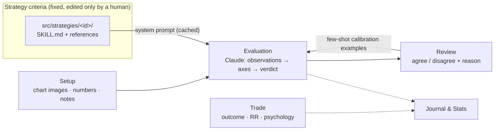
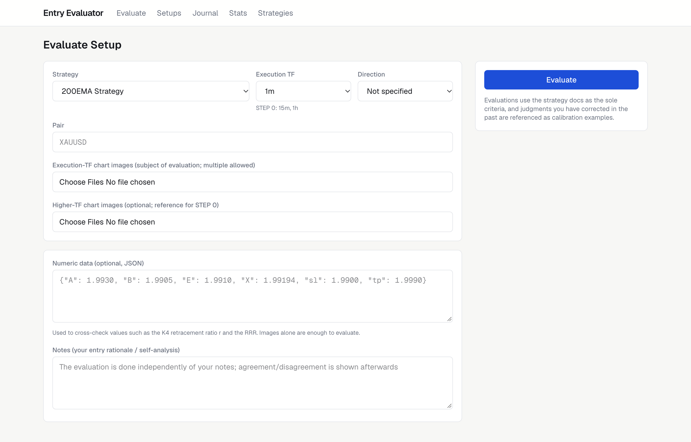
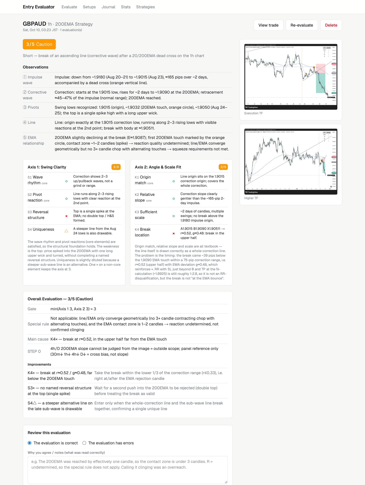
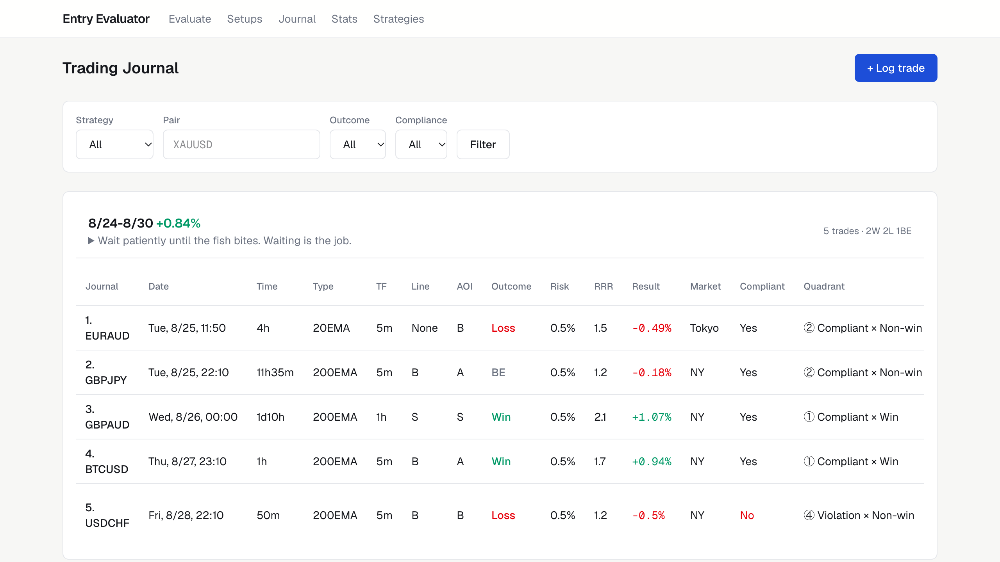
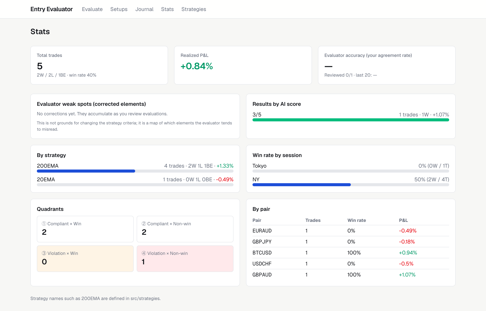

# Daytrading Entry Evaluator

An AI-powered tool that grades whether a day-trading entry setup **complies with the rules of a written trading strategy**, plus a trade journal and stats dashboard to go with it.

Upload a TradingView chart screenshot, and Claude (vision + structured output) scores the setup element-by-element against the strategy's own documentation, then renders a fixed-format report. You review the verdict, correct it when it's wrong, and those corrections become calibration examples for future evaluations.

> Built for my own FX / gold day trading using two EMA-based strategies (20EMA and 200EMA). Deployed on Vercel and used from my phone as a PWA.

## Core idea

**This is a strategy-compliance judge, not a win-rate predictor.**

Most "AI trading" tools try to predict whether a trade will win. This one deliberately doesn't. A losing trade can be a perfectly valid setup, and a winning trade can be a rule violation. What matters for long-term edge is *executing the strategy consistently*, so the evaluator answers one question only: **"Does this setup meet the criteria as written?"**



- **Reviews calibrate reading accuracy, never the criteria.** When you correct an evaluation, the correction is fed back as a few-shot example ("last time you missed X"). The strategy rules themselves don't move.
- **The criteria change only when a human edits the docs** in `src/strategies/<id>/`. Every evaluation stores a hash of the docs (`strategyVersion`), so you can always tell which version of the rules a verdict was made against.
- **Trade outcomes are a separate lane.** Win/loss, RR and psychology go into the journal and stats, but are never fed into the evaluator. Results never leak back into the rules.

## Features

- **Chart evaluation** – upload execution-timeframe (and optionally higher-timeframe) screenshots plus optional numeric prices; get a structured verdict in 1–3 minutes
- **Strategy-driven scoring** – each strategy defines its own observation elements, scoring axes, ○/△/× element criteria, 5-level verdict labels and hard-cap special rules
- **Human-in-the-loop calibration** – agree/disagree with each verdict, correct individual elements, and explain why; corrections are reused as few-shot examples
- **Trade journal** – weekly journal pages (mirroring my Notion layout) with themes, reviews, rule-compliance tracking and a Notion CSV importer
- **Stats** – P&L, win rate by strategy/session/pair, the rule-compliance × outcome quadrant, **evaluator agreement rate**, and a **weak-spot map** of which elements the evaluator gets corrected on most
- **Mobile-first PWA** – add it to your home screen; images are shrunk client-side before upload
- **Pluggable strategies** – add a folder with docs and a definition file; evaluation, review, journal and stats pick it up automatically

## Screenshots

| Evaluate | Result |
|---|---|
|  |  |

| Journal | Stats |
|---|---|
|  |  |

## Tech stack

- **Next.js 16** (App Router, Server Actions) + **React 19** + **TypeScript**
- **Claude API** (`@anthropic-ai/sdk`) – vision input, adaptive thinking, streaming, prompt caching, and **structured outputs validated with Zod**
- **Prisma 7** + **PostgreSQL** (Neon)
- **Vercel Blob** for private image storage (falls back to the local filesystem)
- **Tailwind CSS 4**
- Deployed on **Vercel**

## How an evaluation works

1. `buildSystemPrompt` (`src/lib/evaluator/prompt.ts`) assembles the strategy's skill document and references into a cached system prompt, plus output rules generated from the strategy definition (required observation keys, axis/element keys, allowed verdict labels).
2. Up to 8 past reviews for that strategy (disagreements first) are added as calibration examples.
3. Chart images, pair, timeframe, numbers and notes are sent; Claude returns JSON conforming to `EvaluationOutputSchema` (`src/lib/evaluator/schema.ts`).
4. `renderEvaluation` (`src/lib/evaluator/render.ts`) turns the JSON into the exact Markdown report format the strategy's skill specifies, and both are stored with the model, token usage, criteria version and the IDs of the examples used.

## Project structure

```
src/strategies/              Strategy plugins (the evaluator, UI and journal only read from here)
  types.ts                   StrategyDefinition interface
  index.ts                   Registry (getStrategy / enabledStrategies)
  docs.ts                    Doc loading and criteria-version hashing
  ema200/                    200EMA strategy (trendline break after a 200EMA pullback)
    index.ts                 5 observations, Axis 1 (S1–S4), Axis 2 (K1–K4), verdicts, special rules, docs
    SKILL.md                 Evaluation skill (trendline-eval)
    references/              Strategy overview, key points, model examples / calibration anchors
  ema20/                     20EMA strategy (first 20EMA pullback after a cross)
    index.ts, SKILL.md
src/lib/evaluator/
  schema.ts                  Zod schema for the structured output (strategy-independent)
  prompt.ts                  System prompt (strategy docs, cached) + calibration-example block
  evaluate.ts                Claude call (vision + structured output) → saves Evaluation
  render.ts                  Structured output → Markdown in the skill's output template
src/lib/journal.ts           Quadrants, session inference, week helpers
src/lib/storage.ts           Image storage (Vercel Blob or local FS)
src/lib/auth.ts, proxy.ts    Simple password login via APP_PASSWORD
prisma/schema.prisma         Week / Setup / SetupImage / Evaluation / Review / Trade
scripts/import-notion-csv.mts  Import a Notion Trading Journal CSV
resource/                    Original Claude skill bundles, TradingView Pine scripts, sample journal export
```

## Pages

| Path | What it does |
|---|---|
| `/evaluate` | Submit strategy, execution timeframe, pair, images, numbers and notes for evaluation |
| `/setups`, `/setups/[id]` | Evaluation results (observations / axes / overall / improvements), review form, re-evaluate, link to a trade |
| `/journal` | Weekly journal table (same columns as my Notion CSV + AI score), filters, weekly themes |
| `/journal/new`, `/trades/[id]` | Create / edit a trade |
| `/stats` | Performance stats + **evaluator agreement rate** + **evaluator weak spots** |
| `/strategies`, `/strategies/[id]` | Browse each strategy's criteria and documents |

## Getting started

### Environment variables

Create a `.env` file in the project root:

| Variable | Required | Description |
|---|---|---|
| `ANTHROPIC_API_KEY` | ✓ | Claude API key |
| `DATABASE_URL` | ✓ | PostgreSQL connection string (e.g. Neon) |
| `APP_PASSWORD` | recommended | Enables the login screen. **Always set it on a public URL** |
| `EVAL_MODEL` | | Model used for evaluation (default `claude-opus-5`) |
| `EVAL_EFFORT` | | `low` / `medium` / `high` / `xhigh` / `max` (default `high`; `medium` is faster) |
| `BLOB_STORE_ID` or `BLOB_READ_WRITE_TOKEN` | | Store images in Vercel Blob (private). Without either, images go to `./data/uploads` |
| `DATA_DIR` | | Local storage directory (default `./data`) |

### Run locally

```bash
npm install             # runs prisma generate via postinstall
npm run db:migrate      # apply migrations
npm run dev
```

Import a Notion journal CSV (see `resource/Trading-log-sample/` for the format; English or the original Japanese column names both work):

```bash
npm run import:csv -- "path/to/week.csv" "Weekly theme"
```

### Deploy to Vercel

1. Push to GitHub and import the repo in Vercel
2. From the **Storage** tab, add **Neon (Postgres)** and **Blob**; `DATABASE_URL` and `BLOB_STORE_ID` are injected automatically (Blob uses OIDC; the legacy `BLOB_READ_WRITE_TOKEN` also works)
3. Add `ANTHROPIC_API_KEY`, `APP_PASSWORD`, and optionally `EVAL_MODEL` / `EVAL_EFFORT`
4. Deploy. The build command (`npm run build`) runs `prisma migrate deploy`
5. Open the URL on your phone and "Add to Home Screen" (PWA manifest included)

Evaluations take 1–3 minutes, so `/evaluate` and `/setups/[id]` set `maxDuration = 300` (up to 300s with Fluid compute, even on the Hobby plan). To point your local environment at the same database, run `vercel env pull .env`.

## Adding a new strategy

1. Put the skill document and reference docs in `src/strategies/<id>/`
2. Define a `StrategyDefinition` in `src/strategies/<id>/index.ts` (observations, axes and elements, verdict labels, special rules, overall rows, docs)
3. Add it to the array in `src/strategies/index.ts` with `enabled: true`

Evaluation, review, journal and stats support it automatically.

## License

[MIT](LICENSE)
